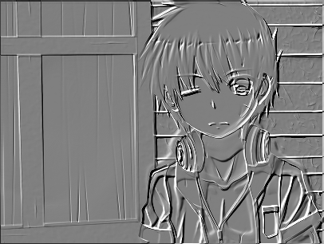
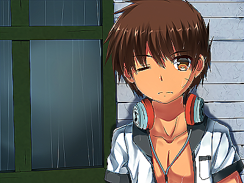

# tlibmp - tiny libbmp

A tiny libary that can read/write/edit .BMP files from disk

[View on Github](https://github.com/yeonzi/tlibmp)

## Overview

It was a lib that can create bmp file, and print in it.

these is some demo with this lib:

### Color print

### Draw lines

### Draw triangles

## Image processing

it also contain some basic	image processing functions.

To show this, I use a picture from pixiv by
[(ˉ﹃ˉ)EM1234](https://www.pixiv.net/member.php?id=8467971) as following:

I have transform it to a bmp file named test.bmp,

Use this lib, I have made the following images:

### Gray

### Binary

### Histogram graph

### Mosaic

### Convolution

In mathematics convolution is a mathematical operation on two functions to produce a third function. 

As picture can treated as a function, we can run convolution operation on a picture, and this will produce magical effect

Firstly, let's try a Gaussian function, the Matrix(convolution core) is:

|     |     |     |     |     |     |     |
|-----|-----|-----|-----|-----|-----|-----|
|     |  1.0|  4.0|  7.0|  4.0|  1.0|     |
|     |  4.0| 16.0| 26.0| 16.6|  4.0|     |
|     |  7.0| 26.0| 41.0| 26,0|  7.0|     |
|     |  4.0| 16.0| 26.0| 16.6|  4.0|     |
|     |  1.0|  4.0|  7.0|  4.0|  1.0|     |
|     |     |     |     |     |     |     |

and this matrix produce this picture:

and then, let's try a matrix like this:

|     |     |     |     |     |
|-----|-----|-----|-----|-----|
|     | -1.0| -1.0|  0.0|     |
|     | -1.0|  0.0|  1.0|     |
|     |  0.0|  1.0|  1.0|     |
|     |     |     |     |     |

easily to find that this matrix will produce a gray picture, just like a sculpture:

a matrix like this will stress the edge of the picture:

|     |     |     |     |     |
|-----|-----|-----|-----|-----|
|     |  0.0| -1.0|  0.0|     |
|     | -1.0|  5.0| -1.0|     |
|     |  0.0| -1.0|  0.0|     |
|     |     |     |     |     |

To make a color inverse, you can use a matrix with the summary small than zero:

## That's all

if you a interesting with this, please give me a star and help me to write document

